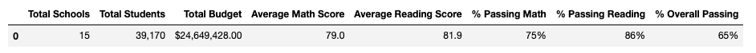
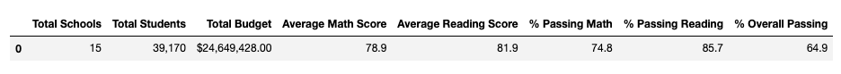

# school_district_analysis

## Overview:

In this school district analysis, I analyzed a list of math and reading scores across across 15 high schools for grades 9th-12th. We sliced and diced the data to see test performance per schoool district, per high school, per grade, per school budget, per school size and per school type. This gave us a wholistic view of which schools performed the best and if factors like school budget or school size had any impact. 

However, the school board notified my client that there is evidence of academic dishonesty specifically from Thomas High School ninth graders in their reading and math scores. I have replaced all ninth grade math and reading scores from Thomas High School with NaNs, while keeping hte rest of the data in tact. 

## Results:
Once I applied the changes, the data changed quite a bit for Thomas High School but we saw only slight differences in how it impacted the overall data. This is because there were only 461 ninth grade Thomas High School students out of the list of 39,170 total students. Let's take a brief look at how the districts were affected overall:

### This is our original district analysis before taking out Thomas High School ninth graders:

### This is our new district analysis after the change:

### Breaking it down:
As you can see above and as I mentioned, there are very slight differences in the data due to only 461 students being removed out of 39,170. Let's break it down:
- Average Math Score: Decreased by 0.1, from 79 to 78.9
- Average Reading Score: Unaffected, did not change
- % Passing Math: Decreased by 0.2 of a percentage point, from 75% to 74.8%
- % Passing Reading: Decreased by 0.3 of a percentage point, from 86% to 85.7%
- % Overall Passing: Decreased by 0.1 of a percentage point, from 65% to 64.9%

## Summary:
Although these are very slight changes to the data, they are all decreases which is accurate since there is evidence of cheating. However, there were other changes in the data after removing the Thomas High School ninth grade students. Thomas High School's scores were down slightly after removing those students, at first glance you may not notice a difference.

1. Thomas High School Average Math score went down, from 83.42 to 83.35
2. Thomas High School Average Reading score actually went up slightly, from 83.85 to 83.90
3. Thomas High School % Overall Passing went down, from 90.95% to 90.63%
4. Thomas High School % Passing Math went down, from 93.23% to 93.19%

Overall, Thomas High School's data shifted after removing the ninth graders. However, Thomas High School remains the No.2 top performing school when filtering through % Overall Passing. Scores by school spending, school size and school type did not change. 
